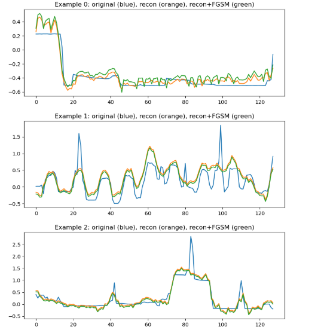

# Privacy-Preserving Data Science Projects

Author: Marios Vardalachakis

This repository holds a variety of data science and machine learning notebooks, particularly focused on privacy-preserving techniques, as well as anomaly detection.

The notebooks in this repository introduce various techniques used to ensure the privacy of sensitive information while still being informative enough to perform analysis on it.

The topics covered in this repository are:

- classical data anonymization
- privacy-preserving fraud detection
- deep learning-based smart home data anonymization


---

# Projects

## Classical Data Anonymization


This project aims to introduce traditional anonymization techniques used to ensure the privacy of sensitive information within a structured dataset.

The techniques used in this project include:

- k-Anonymity

- l-Diversity

- t-Closeness

The project compares different anonymization strategies and evaluates their effect on data utility and retention.

### Example Result

<p align="center">
  
</p>


Project folder:

```
projects/classical-anonymization
```

---

## Privacy-Preserving Fraud Detection

This project investigates fraud detection while applying modern privacy-preserving machine learning techniques.

Three privacy scenarios are explored:

- Generative Adversarial Networks (GANs) for synthetic data generation
- Differential Privacy using Opacus
- Federated Learning simulation

These methods allow models to be trained while reducing exposure of sensitive financial data.

Project folder:

```
projects/privacy-scenarios-fraud-detection
```

---
### Example Result

Visualization comparing real data with GAN-generated synthetic samples using PCA.

<p align="center">
  
</p>


## Smart Home Data Anonymization using Autoencoders

This project applies deep learning techniques to smart home sensor data.

A 1D Convolutional Autoencoder implemented in PyTorch is used to learn compressed representations of time-series sensor data.

The model attempts to preserve useful information while reducing exposure of raw smart home activity patterns.

### Example Result

<p align="center">
  
</p>

Project folder:

```
projects/smart-home-cae
```

---

# Repository Structure

```
kaggle-notebooks
│
├── README.md
├── requirements.txt
├── environment.yml
├── .gitignore
│
├── docs
│   ├── methodology.md
│   └── project_overview.md
│
└── projects
    ├── classical-anonymization
    ├── privacy-scenarios-fraud-detection
    └── smart-home-cae
```

Each project folder contains the following:

- A Jupyter Notebook
- A README for each project
- Visualizations of the results
- visualizations of results
- Configuration files, if necessary


---

# Technologies Used


The projects included in this repository use the following:


- Python
- Pandas
- NumPy
- Scikit-Learn
- PyTorch
- Matplotlib
- Jupyter Notebook
- Differential Privacy


---

# To install the repository, clone the repository using the following command:


```
git clone https://github.com/mariosvard/kaggle-notebooks.git
cd kaggle-notebooks
```

To install the dependencies, use the following command:


```
pip install -r requirements.txt

```
To run the Jupyter Notebook, use the following command:


```
jupyter notebook

```

---

# Data

The datasets used for the projects in this repository cannot be included due to the file size restrictions.

Please download the datasets from the original sources and place the datasets inside the appropriate project folders.

---

# Notes

The purpose of this repository is to serve as a portfolio for my data science projects, showing the application of privacy-preserving machine learning approaches to various datasets.


