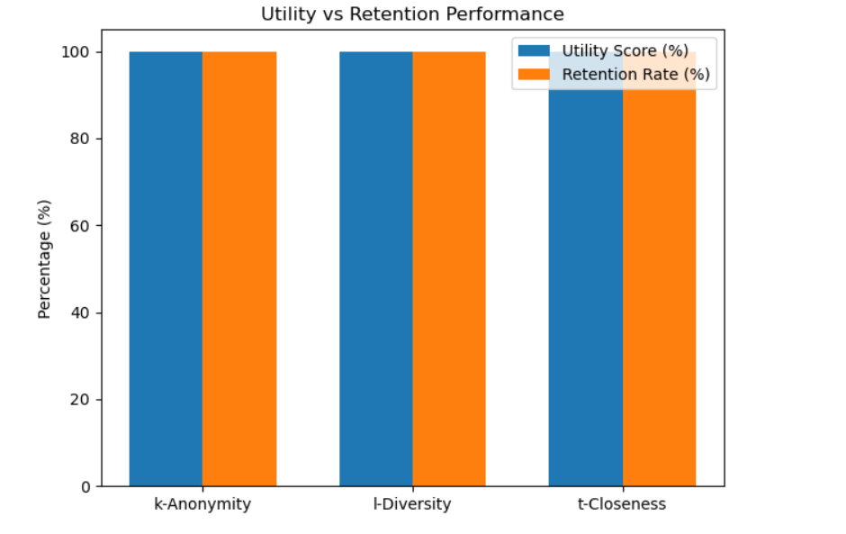

# Classical Data Anonymization

This project explores **classical data anonymization techniques** used to protect sensitive information in structured datasets while preserving their analytical value.

The notebook demonstrates how privacy-preserving transformations can reduce the risk of **re-identifying individuals** in a dataset.

---

## Objective

The goal of this project is to demonstrate how anonymization methods can:

- protect personal and sensitive information
- reduce the risk of re-identification
- maintain useful statistical properties of the dataset

---

## Techniques Explored

The project focuses on traditional anonymization approaches, including:

- **k-anonymity**
- **i-diversity**
- **t-closeness**

These techniques are commonly used in privacy-preserving data publishing and data protection research.

---

## Workflow

The notebook follows a typical anonymization pipeline:

1. Load and inspect the dataset
2. Identify potential quasi-identifiers
3. Apply anonymization techniques
4. Compare the dataset before and after anonymization
5. Evaluate the impact on data utility

---

## Results

The following visualization compares the **utility score** and **retention rate** of different anonymization techniques.

The comparison shows that different anonymization techniques maintain high data utility while protecting sensitive information.

---

## Notebook

The implementation and analysis are contained in the following notebook:

`Classical_Anonymization.ipynb`

The notebook includes:

- dataset preprocessing
- anonymization techniques
- visualization of results

---

## Technologies Used

The project was implemented using:

- Python
- Pandas
- NumPy
- Matplotlib
- Jupyter Notebook

---

## Data

The dataset is **not included** in this repository due to file size limitations.

Please download the dataset from its original source and place it in the appropriate project folder before running the notebook.

---

## Notes

This project is intended as a demonstration of **basic privacy-preserving data techniques** used in data science and data protection workflows.
