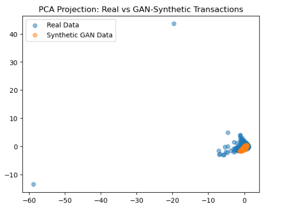
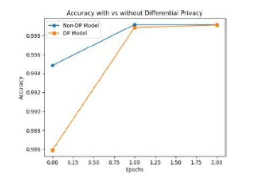
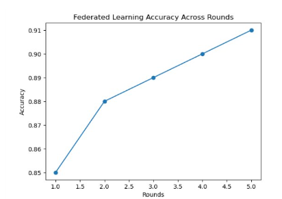

# Privacy-Preserving Fraud Detection

This project aims to examine techniques in fraud detection, as well as techniques in privacy-preserving machine learning. The main purpose of this project is to show how these latest technologies in privacy can be used in analyzing financial transaction data.Technologies to be used in this project:

*   Generative Adversarial Networks (GANs)
*   Differential Privacy
*   Federated Learning

These technologies allow machine learning models to be trained without compromising financial data.

---

## Objective

The main objectives of this project are:

- To analyze financial transaction data, usually used in fraud detection
- To generate synthetic financial transaction data using GANs
- To train machine learning models using Differential Privacy
- To simulate Federated Learning rounds
- To examine how these techniques in privacy affect model performance

---

## Dataset

The experiments use the Credit Card Fraud Detection dataset, which can be found on the Kaggle platform.

**Credit Card Fraud Detection Dataset**

This dataset contains anonymized credit card transactions from European cardholders.

**Dataset Characteristics**

- transaction features
- anonymized numerical variables
- fraud labels (fraud / non-fraud)

**Typical Attributes**

The dataset includes:

- anonymized numerical transaction features (V1–V28)
- time of transaction
- amount of transaction
- label for fraudulent transactions (0 for legitimate, 1 for fraud)

  
Due to file size limitations, the dataset is **not included in this repository**.

You can download it from:

https://www.kaggle.com/datasets/mlg-ulb/creditcardfraud

After downloading, place the data within the project directory before running the notebook.

---

## Methods Explored

The notebook explores several modern machine learning and privacy techniques:

### Generative Adversarial Networks (GAN)

GANs are used to generate **synthetic financial data** that preserves statistical properties of the original dataset.

This helps address:

- class imbalance
- privacy concerns
- data scarcity

---

### Differential Privacy

The model is trained using **Differential Privacy (Opacus)** to protect sensitive information during training.

Differential privacy introduces noise into the training process to ensure that individual records cannot be reconstructed.

---

### Federated Learning Simulation

The notebook simulates **federated learning rounds**, where multiple nodes collaboratively train a model without sharing raw data.

This approach is useful in environments where data cannot be centrally stored.

---

## Visualizations

### GAN Synthetic Data vs Real Data (PCA Projection)

Visualization of real data and GAN-generated synthetic samples.

  

---

### Differential Privacy Training Performance

Comparison of model accuracy with and without differential privacy.

  

---

### Federated Learning Training Progress

Training accuracy across multiple federated learning rounds.

  

---

## Notebook

The full implementation is provided in:

`Fraud_Detection_from_kagglee2.ipynb`

The notebook includes:

- data preprocessing
- GAN-based synthetic data generation
- differential privacy training
- federated learning simulation
- visualization of model performance

---

## Technologies Used

The project was implemented using:

- Python
- Pandas
- NumPy
- PyTorch
- Opacus (Differential Privacy)
- Matplotlib
- Scikit-learn
- Jupyter Notebook

---

## Notes

This project demonstrates how **privacy-preserving machine learning techniques** can be applied in fraud detection scenarios where sensitive financial data must remain protected.

